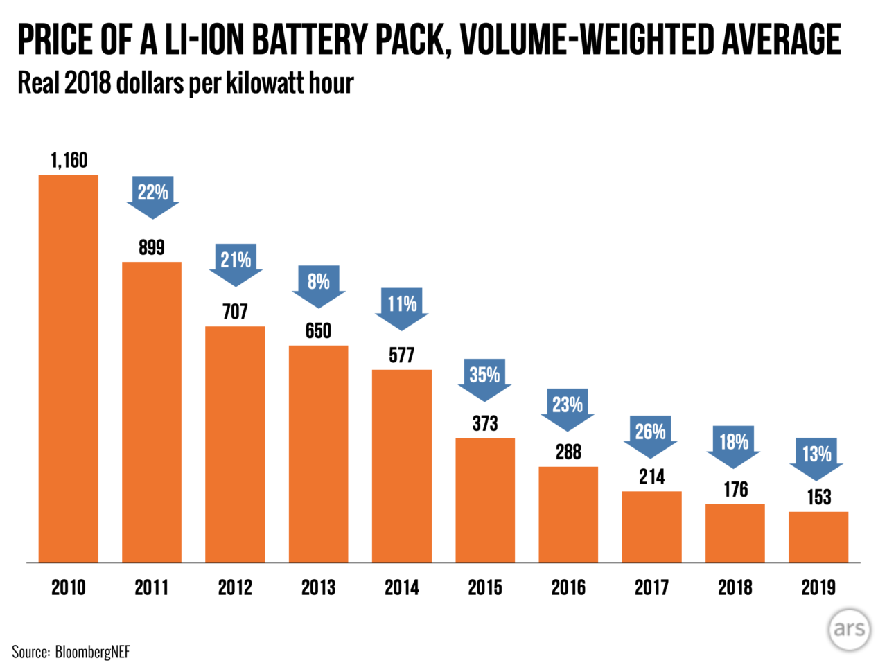

{
  :author "mrchrisadams"
  :title "Notes from reading a recent backgrounder piece in Ars about batteries and the grid"
  :date "2020-05-23 13:40:19"
}

This [piece in Arstechnica][ars1] about changes in the costs of batteries, and how it affects the interplay between electricity grids and electric vehicles  is a pretty accessible, but it also goes into suprising amounts of detail about what Lithium batteries are made of.

It also includes a few eye-opening charts, like this one showing how the price of battery storage has fallen in the last ten years:

[ars1]: https://arstechnica.com/features/2020/05/the-story-of-cheaper-batteries-from-smartphones-to-teslas/

It also introduced a few ideas that I figure are worth sharing:
****
### Lithium ion is a umbrella term

I didn't know before reading this that Lithium Ion was a sort of [umbrella term for different kinds of batteries][umbrella1] - the term can cover a number of different kinds of batteries each, using chemistry that challenges assumptions I had that batteries were largely made of materials that only came from a few places in the world, and often where conflict minerals are mined.

[umbrella1]: https://hyp.is/GnGHipzoEeq8oWe_Qb_X0g/arstechnica.com/features/2020/05/the-story-of-cheaper-batteries-from-smartphones-to-teslas/

### You _can_ source materials to reduce dependencies on conflict minerals

I also didn't know that large companies are now taking steps to [source materials domestically to address these issues][nmca1]:

> "The cells, developed with LG Chem, use an NMCA chemistry, which uses a combination of nickel, manganese, cobalt, and aluminum for the cathode," Gitlin wrote. "GM says it has reduced the use of cobalt by 70 percent compared to the cells in a Chevrolet Bolt EV and that it plans to source as many of the raw materials from North America as possible."

[nmca1]: https://hyp.is/odRKRJzqEeqDaOPJpJV6CQ/arstechnica.com/features/2020/05/the-story-of-cheaper-batteries-from-smartphones-to-teslas/

